# Intermediate Algebra

Note: Materials needed: sticky notes

## Schedule

| | |
|---|---|
| 8:00 - 8:15 | Eat breakfast, fun activity |
| 8:15 - 9:15 | 1st lesson |
| 9:15 - 10:00 | Independent work time |
| 10:00 - 10:15 | Break |
| 10:15 | Question of the day |
| 10:25 - 11:15 | 2nd lesson |
| 11:15 - 12:15 | Independent work time |
| 12:15 | Dismiss |

# Welcome

## Fun activity

Note: Shrek, Mary Poppins, Barack Obama, Yoda, Darth Vader, Amelia Earhardt, The Little Mermaid, Bambi, Serena Williams

<!-- .slide: data-background="#000000" -->
## Your first task

<!-- .slide: data-background="#000000" -->
## Four 4s

Create the numbers 1-20 using *exactly* four 4s and any math operations.
 

|  |  |  |  |
|---|---|---|---|
| 1 | 6 | 11 | 16 = 4+4+4+4 |
| 2 | 7 | 12 | 17 |
| 3 | 8 | 13 | 18 |
| 4 | 9 | 14 | 19 |
| 5 | 10 | 15 | 20 |

  <aside class="footnotes">
    

    
<super>*</super> Table generate with AI.

  </aside>
[1] [https://htmlmarkdown.com](https://htmlmarkdown.com/syntax/markdown-tables/)

## Commitments

1. Cultivate respect, maintain composure despite failure
2. Be open to learning from students and seek to understand their perspectives
3. Tell you why so that you have a sense of purpose
4. Break the learning down into manageable chunks
5. Support you to take responsibility for your learning: not overexplaining, giving you time to think, providing practice tasks

## Math

$$ J(\theta_0,\theta_1) = \sum_{i=0} $$

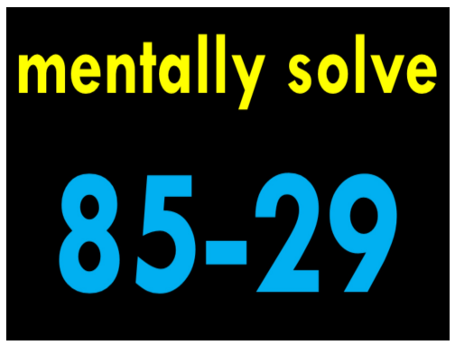

# Mathematical Practice

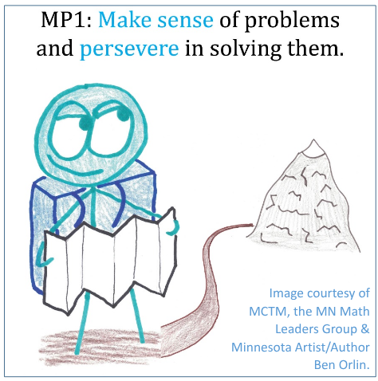
“Admire this 
mountain before you. Then plan a path 
and start hiking. Mountains don’t 
climb themselves!” 
- Ben Orlin

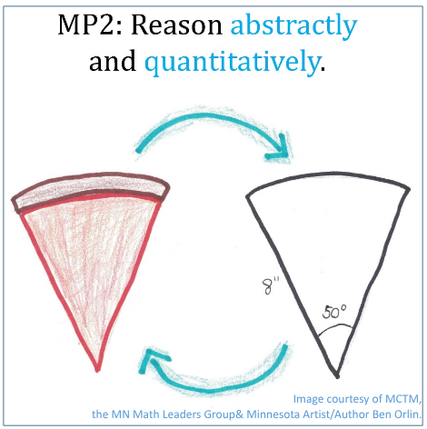
“A pizza is more 
complicated than a circle. 
It’s cheesy, warm, 
crusty, oily, crumbly… 
The circle is none 
of those things. 
And that’s the whole point: 
the mathematical picture lets us focus on size and shape, without getting distracted by all the cheesy details.”
- Ben Orlin

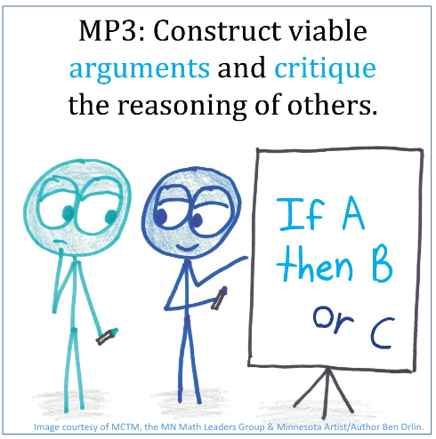
In everyday life, 
we treat opinions 
as 'mine' & 'yours.' 
But a logical argument 
doesn't belong to anyone. 
It stands alone, 
apart from us, 
and whether 
it's true or false i
s all about the claim itself
-- not who happens 
to be saying it." 

- Ben Orlin

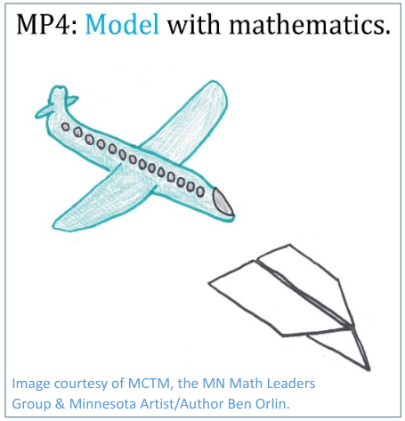
“Planes are complicated. But just by folding a piece of paper, you can learn a lot about flight. The same goes for math: the world is complicated, but simple tables and equations can tell us a lot.”
- Ben Orlin

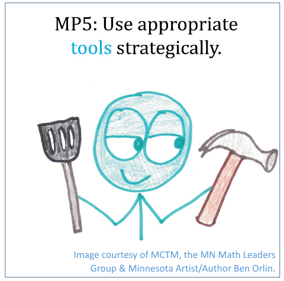
“When using a mathematical tool, make sure it’s the right one for the job. You wouldn’t flip a pancake with a hammer, or drive in a nail with a spatula!”
- Ben Orlin

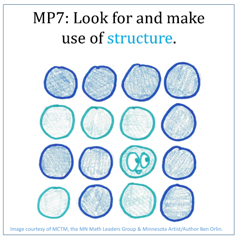
“In math, structure is another word for patterns. What patterns do you see in this image?”
- Ben Orlin

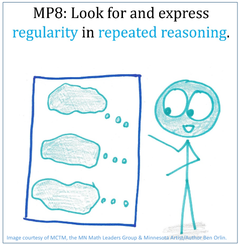
“When solving a problem, you’ll sometimes find yourself following the same thought process, over and over. When you notice this, you should take a step back, and figure out why that repetition is happening!”
- Ben Orlin

[factorization diagrams](https://www.datapointed.net/visualizations/math/factorization/animated-diagrams/)

## Number talks

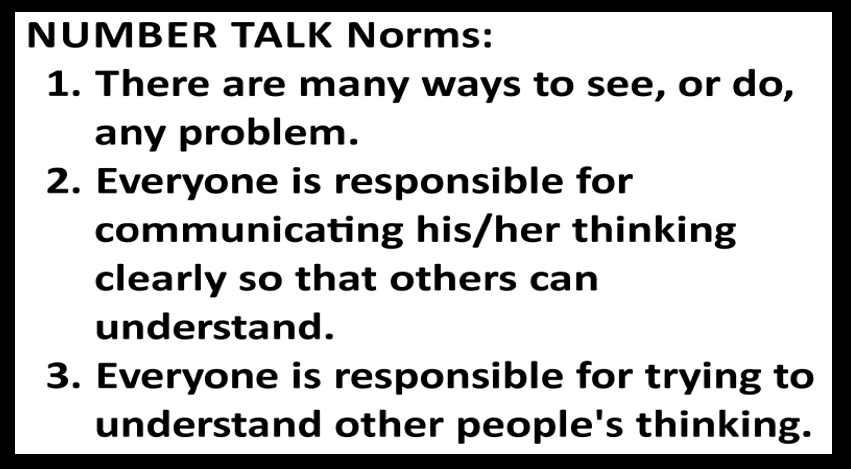

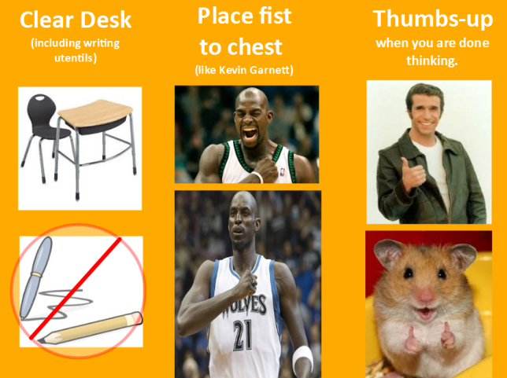

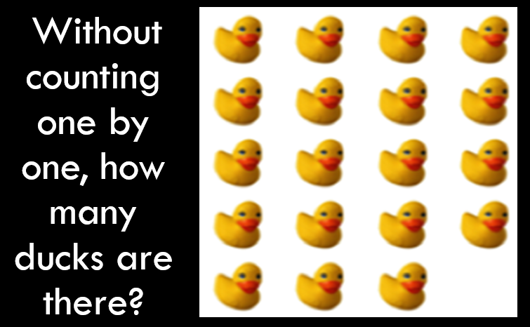

# Dots

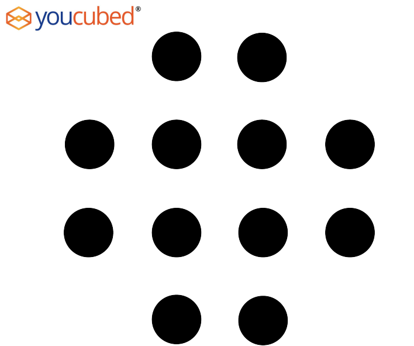

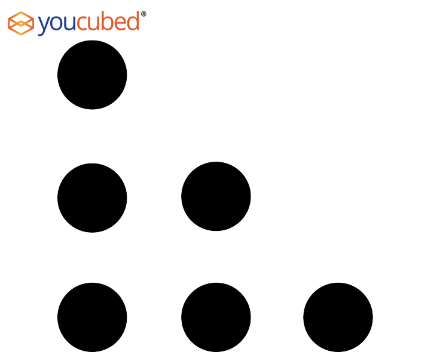

# Set 1 CHALLENGE

You are about to see a larger group of dots.

Instead of saying how may dots there are, find as many ways as you can to show how you know what the total is.

Here is an example.

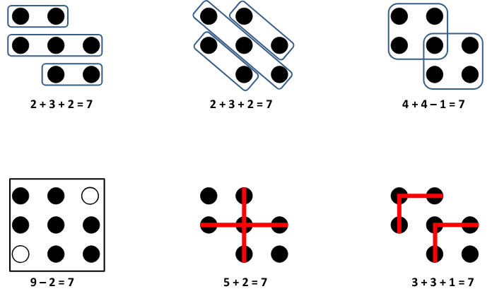

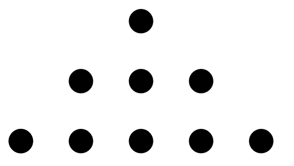

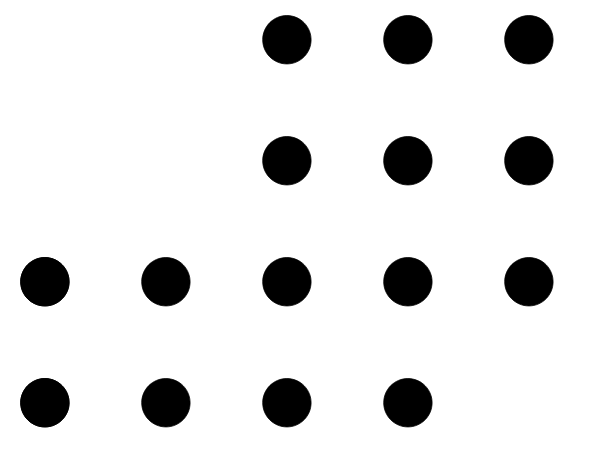

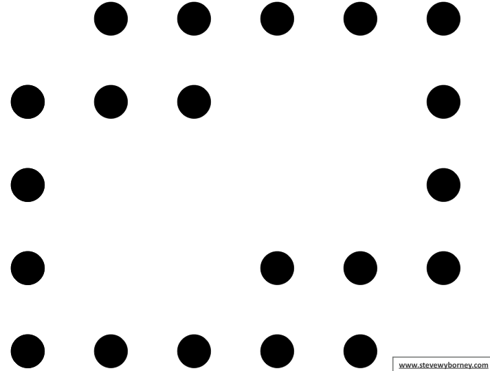

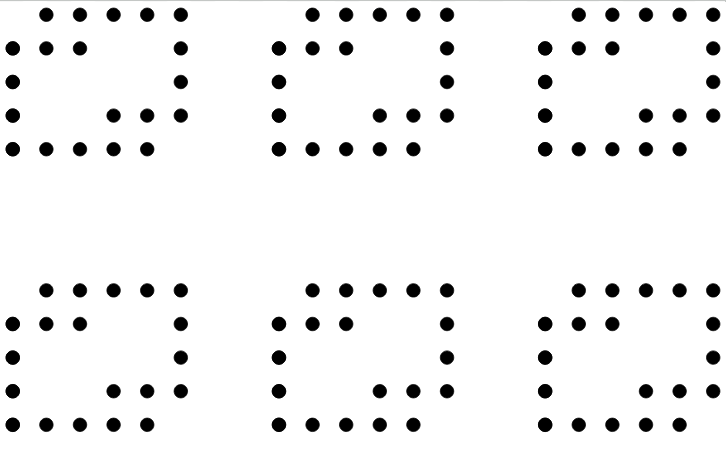

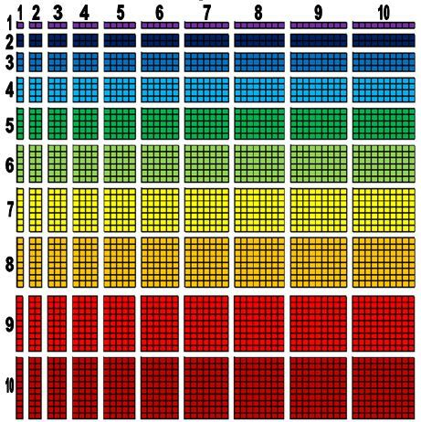

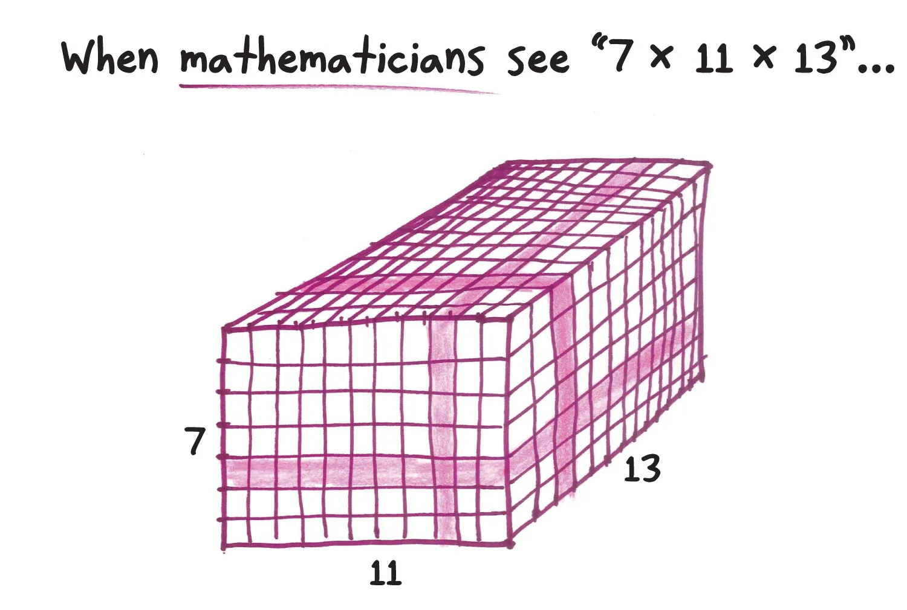

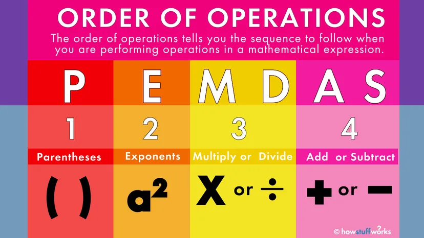

## ⚠️ THE TWO BIGGEST TRAPS ❌ Trap 1: The "M before D" Myth

* The Myth: You must always multiply before you divide.
* The Truth: They are a team. Go left to right.
* Example: 12 ÷ 3 × 2
* Do 12 ÷ 3 first → 4 × 2 = 8 (Correct)
   * Do NOT do 3 × 2 first → 12 ÷ 6 = 2 (Incorrect)

## ❌ Trap 2: The Fraction Wall

* The Rule: A fraction bar splits the problem into two separate zones.
* Simplify the entire top, simplify the entire bottom, and then divide at the very end.

